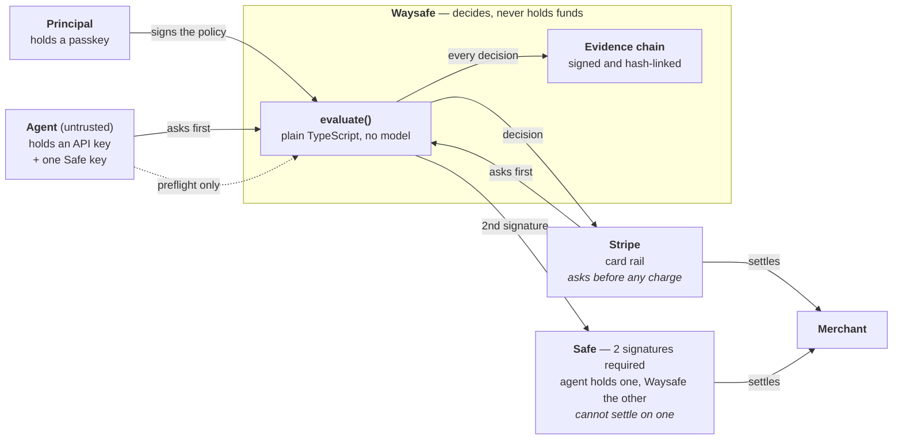
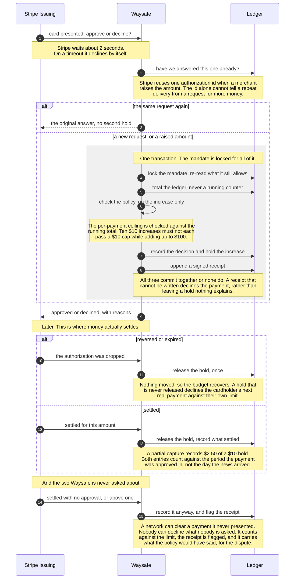
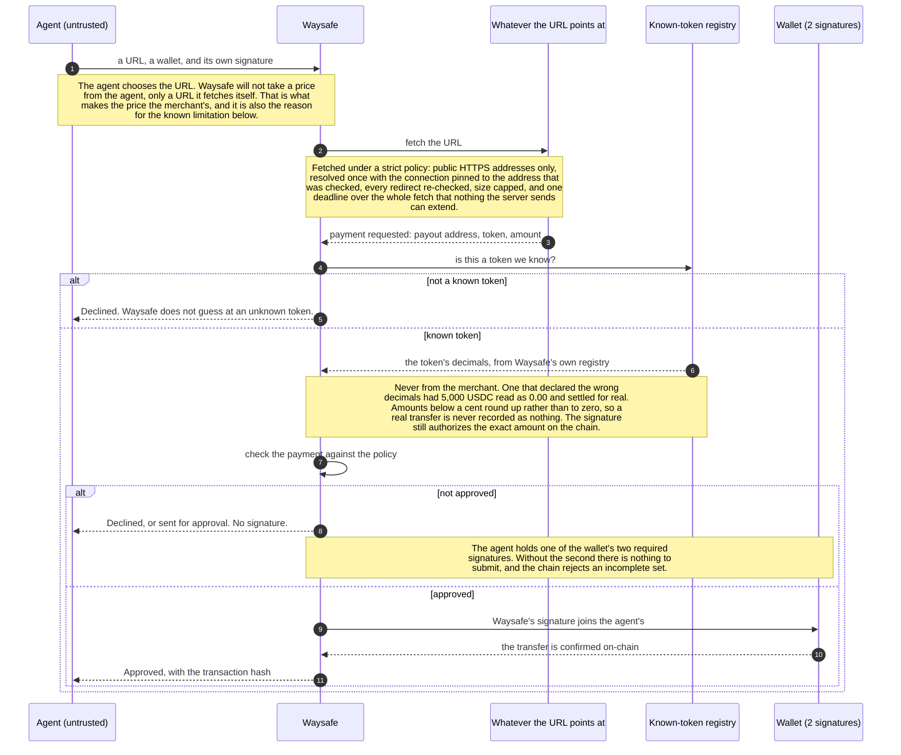

# Waysafe — Threat Model

**Audience:** a payments or risk lead deciding whether to rely on Waysafe as a required signer. This describes the system as it runs in this repository today.

**How to read it.** §0 is the system in five diagrams. §1–§8 are one attack surface each, in a fixed shape: the attack, the control, the decision-log entry (`D-n` in [`DECISIONS.md`](../DECISIONS.md)), the test file, and the residual risk. §9 is fail-closed behaviour on both rails. §10 lists what we do not know. The appendices hold the detail as tables.

Two rules this document follows. Every claim names a test file, or says that no test covers it. A test that needs an external resource is marked as gated, because a test that exists and a test that ran are different claims (§8).

Each section ends with a **Decision record** line linking the entries in [`DECISIONS.md`](../DECISIONS.md) that cover it. That is the only place internal identifiers appear.

---

## 0. The system in one page

### 0.1 Who holds which key

Waysafe decides and never holds funds. Both rails ask Waysafe before money moves; the agent's own cooperation is never what stops it.

Appendix A lists each key, what it signs, and its blast radius.

### 0.2 The card lifecycle

Stripe asks, Waysafe answers inside about two seconds, and one transaction covers the decision, the ledger hold and the evidence event. Everything after the decision was missing until a second adversarial review. A card authorization is not one event, and a hold that is never released is a limit that never recovers.

### 0.3 The on-chain decision path

The agent chooses the URL and Waysafe fetches it under a policy. The agent holds one of the Safe's two required signatures.

### 0.4 What can be forged

An agent can assert anything. The question each row answers is what that assertion can produce.

```mermaid
flowchart TB
  classDef limitation fill:#ffe6cc,stroke:#c75300,stroke-width:2px,color:#4a2200

  subgraph AG["An agent can claim"]
    direction TB
    A1["any merchant name<br/>or account identifier"]
    A2["any amount, currency<br/>or category"]
    A3["which URL Waysafe fetches"]
    A4["a signature over<br/>the payment it wants"]
  end

  subgraph AGN["None of it earns an ALLOW"]
    direction TB
    B1["A claim the agent made<br/>can only ask for approval"]
    B2["One checked identifier<br/>never vouches for another"]
    B3["Waysafe reads the price<br/>from the merchant, not the agent"]
    B4["One of two signatures.<br/>Two are required."]
  end

  subgraph ME["A merchant can declare"]
    direction TB
    C1["its own payout address<br/>and domain"]
    C2["a token contract address"]
    C3["how many decimals<br/>that token has"]
  end

  subgraph MEN["None of it changes the amount"]
    direction TB
    D1["Decimals come from Waysafe's<br/>own registry of known tokens"]
    D2["An unknown token is declined,<br/>never guessed at"]
    D3["Known limitation: only the<br/>merchant vouches for its<br/>own payout address"]:::limitation
  end

  subgraph NE["Neither can"]
    direction TB
    E1["forge a receipt signature"]
    E2["raise a limit or edit a policy"]
    E3["approve its own request<br/>for approval"]
    E4["spend without the rail<br/>asking Waysafe first"]
  end

  A1 --> B1
  A1 --> B2
  A3 --> B3
  A4 --> B4
  C3 --> D1
  C2 --> D2
  C1 --> D3
```

### 0.5 Attack map

Ten surfaces, their controls, and what is still open. Status is in the text of each box, so colour is not the only signal. The five boxes added after the second independent review are C14 through C18.

```mermaid
flowchart LR
  classDef closed fill:#dcf2dc,stroke:#2e7d32,stroke-width:2px,color:#14321a
  classDef open fill:#ffe6cc,stroke:#c75300,stroke-width:2px,color:#4a2200
  classDef partial fill:#dceaf8,stroke:#1565c0,stroke-width:2px,color:#0c2b4d

  S1["<b>1</b> Leaked agent key"]
  S2["<b>2</b> Principal passkey"]
  S3["<b>3</b> Code execution on the API"]
  S4["<b>4</b> Database write access"]
  S5["<b>5</b> Compromised dependency"]
  S6["<b>6</b> Hostile merchant"]
  S7["<b>7</b> Replayed rail webhook"]
  S8["<b>8</b> Forged rail webhook"]
  S9["<b>9</b> Leaked org credential"]
  S10["<b>10</b> Prompt injection into the compiler"]

  C1["CLOSED — a route refuses any<br/>credential not named for it"]:::closed
  C2["CLOSED — approval needs a second<br/>mandate, and costs both budgets"]:::closed
  C3["CLOSED — a signature is good for<br/>one purpose only"]:::closed
  C4["CLOSED — each identifier carries<br/>its own proof"]:::closed
  C5["CLOSED — Waysafe owns the<br/>token decimals"]:::closed
  C6["CLOSED — a repeat delivery gets<br/>the original answer"]:::closed
  C7["CLOSED — a hold counts against the<br/>period it was approved in"]:::closed
  C8["CLOSED — every webhook signature<br/>is verified"]:::closed
  C9["CLOSED — no model is in the<br/>authorization path"]:::closed
  C12["CLOSED — a fetched URL is checked,<br/>and the connection pinned to it"]:::closed
  C13["CLOSED — decision, hold and receipt<br/>commit together"]:::closed
  C14["CLOSED — an agent reaches only<br/>its own authorizations"]:::closed
  C15["CLOSED — a raised amount is a new<br/>decision on the increase"]:::closed
  C16["CLOSED — the whole card lifecycle:<br/>release, settle, refund"]:::closed
  C17["CLOSED — a policy signature cannot<br/>enrol a passkey"]:::closed
  C18["CLOSED — no transfer records as zero,<br/>and counts stay counted"]:::closed
  C10["PARTIAL — the chain is signed and<br/>linked, decisions included"]:::partial
  C11["PARTIAL — an injected policy still<br/>needs a human ceremony"]:::partial
  C19["PARTIAL — a payment nobody was asked<br/>about is recorded and flagged"]:::partial

  O1["OPEN — Waysafe's own signing key alone<br/>completes a signed transfer"]:::open
  O2["OPEN — nothing outside Waysafe proves<br/>the record is complete"]:::open
  O3["OPEN — the activation challenge<br/>is predictable"]:::open
  O4["OPEN — only the merchant vouches for<br/>its own payout address"]:::open
  O5["OPEN — database write access mints<br/>credentials and biases spend"]:::open
  O6["OPEN — a dependency can alter the<br/>policy engine itself"]:::open
  O7["OPEN — no kill switch for the<br/>signing key"]:::open
  O10["OPEN — an org credential can enrol a<br/>principal's FIRST passkey unaided"]:::open
  O11["OPEN — the principal reads a summary.<br/>Nothing proves they understood it"]:::open
  O12["OPEN — an approval request that lapses<br/>leaves no signed record"]:::open
  O13["OPEN — no rate limit. A leaked key is<br/>bounded by policy, not volume"]:::open

  S1 --> C1
  S1 --> C2
  S1 --> C4
  S1 --> C12
  S1 --> C14
  S1 --> O13
  S2 --> C3
  S2 --> C17
  S2 --> O3
  S3 --> C10
  S3 --> O1
  S3 --> O7
  S4 --> O5
  S4 --> C10
  S5 --> O6
  S6 --> C5
  S6 --> C4
  S6 --> C18
  S6 --> O4
  S7 --> C6
  S7 --> C7
  S7 --> C13
  S7 --> C15
  S7 --> C16
  S7 --> C19
  S8 --> C8
  S9 --> C1
  S9 --> O10
  S10 --> C9
  S10 --> C11
  S10 --> O11
  C10 --> O2
  C13 --> O12
```

---

## 1. A leaked agent key

**The attack.** An attacker holding one agent API key makes requests as that agent. It could once also mint a key for any other agent in the organization, including its own approver's, which collapsed the two-credential approval requirement back to one key.

**The control.** Route authorization is default-deny by credential tier: every route is org-credential-only unless explicitly listed as agent-accessible. Four more routes with the same shape were closed in the same inversion, the worst being mandate creation, which had let an agent write itself a policy with any ceiling. Resolving a step-up requires a different, principal-named approver mandate's own credential, and an approval now costs budget on both mandates.

**Tests.** `apps/api/src/server.adversarial.test.ts` (eight attack cases plus a structural guard that enumerates every registered route), `apps/api/src/authorization/service.test.ts`, `apps/api/src/authorization/budget.adversarial.test.ts` (gated on `DATABASE_URL`), `apps/api/src/review2.adversarial.test.ts` R4 for the object-authorization case (gated).

**Blast radius.** One leaked agent key reaches that agent's own authorizations and nothing else. The route tier used to be the only check, so any agent credential in the organization could list, read and execute *another* agent's authorization. It could also choose the payment instrument at execution. That is how the second independent review spent an authorization it did not own. List and read are now scoped to the acting agent, and execution resolves the instrument from the authorization's own declared `payment_method_ref` rather than from the request body. The step-up route keeps no ownership check on purpose, because resolving a step-up requires a different agent.

**Residual risk.** Authority now depends on two credentials. That reduces blast radius only if the two are held under separate custody, and nothing in this codebase enforces that. There is also no rate limiter on any route, so a leaked key is bounded by policy rather than by volume.

**Decision record:** [D-18](../DECISIONS.md#d-18-agent-api-keys-the-key-is-the-source-of-truth-for-agent-identity-and-rejection-is-a-decision-not-a-401), [D-62](../DECISIONS.md#d-62-approver-mandates-built-closes-d-59), [D-64](../DECISIONS.md#d-64-route-authorization-is-default-deny-by-credential-tier-adversarial-review-finding-1), [D-65](../DECISIONS.md#d-65-four-more-routes-with-the-same-shape-found-by-the-remediation-audit), [D-71](../DECISIONS.md#d-71-an-approved-step-up-charges-the-mandate-that-spent-review-finding-5), [D-73](../DECISIONS.md#d-73-approval-re-validates-the-spending-mandate-under-the-lock), [D-78](../DECISIONS.md#d-78-an-authorization-belongs-to-the-agent-it-was-decided-for-review-2-r4). Reversed once: D-59 recorded this surface as closed by D-62, and D-64's finding reopened it.

---

## 2. The principal's passkey

**The attack.** The passkey is what turns a compiled policy into an active mandate, so it is not bounded by anything else in this document. An authentication challenge could once be answered with a registration response, which enrolled an attacker's own passkey against a victim principal.

**The control.** Every challenge records the purpose it was issued for, and a caller's mode is validated against it. A mismatch is a `400 challenge_purpose_mismatch`. Enrolling a second passkey for a principal that already has one requires a fresh prior authentication with an existing credential, as a single-use expiring grant bound to that principal and credential.

**One purpose per operation.** The first fix made the purpose binding but left one value, `AUTHENTICATION`, covering two different operations: activating a mandate, and proving control of an existing passkey in order to enrol another. Both completion paths accepted it. The signature a principal gives to confirm a policy is the one ceremony a real principal is actually shown, and it could be redeemed at the passkey route to mint an enrolment grant for an authenticator of the attacker's choosing. The second independent review did exactly that. `MANDATE_AUTHENTICATION` and `REENROLLMENT_AUTHENTICATION` are now distinct, each accepted only by its own path. The old shared value is accepted nowhere.

**Tests.** `apps/api/src/server.adversarial.test.ts`, `apps/api/src/webauthn/service.test.ts`, `apps/api/src/webauthn/webauthn.test.ts`, `apps/api/src/review2.adversarial.test.ts` for the enrolment-grant case (gated on `DATABASE_URL`), including a control that the legitimate re-enrollment ceremony still works end to end.

**Residual risk.** An org credential can still enrol a principal's *first* passkey and activate a mandate with no human present. The grant above only covers a second one. One open question remains: the mandate-activation challenge is derived from the public policy hash rather than being random, so it is predictable. That is now confined to mandate activation. The re-enrollment challenge is random, and is the only value its own path will take.

**What WebAuthn still resists, and what it does not.** The private key never leaves the authenticator. Relying-party id and origin are checked on every ceremony, and production's relying-party id is `dashboard.waysafe.ai` rather than the apex, so no other subdomain can ever present it. Two paths defeat that and neither is defended against here: a compromised script running at the legitimate origin, and device-level compromise that never goes through a browser ceremony.

**Decision record:** [D-20](../DECISIONS.md#d-20-webauthn-the-challenge-is-the-policy_hash-rp-id-is-localhost-for-the-sprint), [D-29](../DECISIONS.md#d-29-production-webauthn-rp-id-dashboardwaysafeai-a-subdomain-not-the-apex-resolves-oq-5), [D-66](../DECISIONS.md#d-66-the-challenges-stored-purpose-is-authoritative-a-second-passkey-needs-a-grant-review-finding-2), [D-67](../DECISIONS.md#d-67-mandate-creation-validates-the-principals-tenancy-review-finding-2-sub-finding), [D-86](../DECISIONS.md#d-86-one-challenge-purpose-per-operation-review-2-r5). The open question above is OQ-12.

---

## 3. Code execution on the API process

**The attack.** Five secrets load into this one process: the evidence signing key, the x402 attestation key, the Safe co-signer key, and two Stripe keys. An attacker with code execution here holds all of them.

**The control.** There is no control for the keys themselves. §7 describes where they live. The Safe's threshold of 2 does not help, because the co-signer is one of its two legitimate owners.

**Tests.** None for this scenario. It is not a credential-theft case a test can express. The co-signer exposure was demonstrated by a real broadcast, tx `0x6a3510ae998379de96e2fadde2e44161c3368ca8f4265dce3217ca58ec43088d`: a successful transfer completed by the co-signer key alone, over a payload the session key had signed.

**Residual risk.** This is the largest open item in this document, and §9 states it in full.

**One secondary exposure.** The logger redacts a hand-maintained list of paths in `apps/api/src/server.ts`. It is a blocklist, so a new field carrying a credential is logged until someone adds it. A 5xx response body never echoes an error message, so an internal failure no longer leaks its text to a caller.

**Decision record:** [D-56](../DECISIONS.md#d-56-the-cosigner-key-alone-can-complete-a-pending-safe-transaction-the-2-of-2-is-not-a-defense-against-holding-it), [D-59](../DECISIONS.md#d-59-12-no-longer-contradicts-21-a-second-d-56-shaped-gap-found-by-auditing-for-the-pattern-a-named-remediation-direction), [D-63](../DECISIONS.md#d-63-a-signer-interface-the-key-boundary-now-exists-in-code), [D-75](../DECISIONS.md#d-75-server-side-request-forgery-through-resource_url-seventh-finding-self-found).

---

## 4. Database write access

**The attack.** An attacker who can write rows but has none of §3's keys can mint credentials from nothing: `verifyKey` looks up a prefix and compares a SHA-256 hash, so inserting a row with a hash of a chosen secret is enough to authenticate. The same access can insert `LedgerEntry` rows, which changes what every future `evaluate()` believes has been spent.

**The control.** None for either. Evidence is the one thing this attacker cannot forge: the signing key lives only in process memory, so a rewritten chain fails `signature_invalid` against the published key.

**Tests.** `packages/core/src/evidence.test.ts` proves the forgery-detection half, including a full-chain rewrite. **No test covers the credential-minting or ledger-biasing claims.** They are read from the code, not demonstrated.

**Residual risk.** Database write access is authority over future decisions. It is not authority over past records.

**Decision record:** [D-54](../DECISIONS.md#d-54-docsthreat-modelmd-written-for-a-card-network-security-reviewer).

---

## 5. A compromised dependency

**The attack.** Blast radius depends on which process the dependency's code runs in. A package reachable from `packages/core` can alter `evaluate()` itself, which produces an incorrect ALLOW without touching a key.

**The control.** None. `@waysafe/core/browser` exists so the dashboard and the browser bundle do not pull in `node:crypto`, which narrows what reaches a browser, and does not narrow what reaches the API.

**Tests.** **No test covers this.** The browser entry point's import surface was verified mechanically when it was built. Nothing tests for a hostile dependency.

**Residual risk.** A `packages/core` dependency is the one supply-chain position that changes decisions rather than stealing credentials. Nothing in this document bounds it.

**Decision record:** [D-43](../DECISIONS.md#d-43-story-a-cinematic-simulation-for-a-60-second-video-and-the-browser-safe-waysafecore-subpath-it-needed).

---

## 6. Replayed and forged rail webhooks

**The attack.** Stripe redelivers events. An identical redelivery once produced a second authorization row and a second reservation, so $120 was held for one $60 card authorization, and the duplicate hold had no event that would ever clear it. A forged webhook is a different attack: asserting a decision Stripe never made.

**The control.** A replay returns the original decision, writes no new row and takes no new hold. Two concurrent deliveries are decided by a unique index on `(mandateId, externalRef)`, because the lookup alone sits outside the transaction. Every rail webhook's HMAC signature is verified against the raw request bytes, which is why the JSON parser preserves them.

**The replay key was not enough, and the lifecycle was not modelled.** Four defects the second independent review found here, all now closed and drawn in §0.2:

- **An incremental request replayed the original approval.** Stripe reuses one authorization id when a merchant raises the amount, so keying the replay on the id alone meant $10 approved, then the same id re-presented at $10,000, approved. The key now includes the revision. An increase is decided as a new decision on the delta, and the per-payment ceiling is checked against the running total.
- **A provider event was consumed before its effect committed.** The event row was written first, so a ledger failure left the event marked processed, the retry classified as a duplicate, and the budget uncredited. The event and its effect now commit together, and a failure is explicitly retryable rather than silently terminal.
- **A cumulative refund total was applied as a delta.** Stripe's `amount_refunded` is a running total. $40 then $100 of one $100 charge produced a net ledger amount of **minus $40**, which is $140 of fresh budget out of a $100 charge. Only the delta is credited now.
- **Reversals and expiries never released their hold, and a partial capture recorded the wrong amount.** Every Issuing update except a closed, approved one was ignored, so a reversed authorization held budget forever. A settlement now captures what settled, not what was authorized.

**And two the rail never asks about.** A **force capture** is a settlement the network clears without ever presenting an authorization. An **overcapture** settles above what was approved. Neither can be declined, because nobody is asked. `issuing_transaction.created` was not handled at all, so both moved money with nothing in Waysafe recording it. Both are now charged against the cap and recorded as a `DENY` on an `EXECUTED` row, which records both facts. Each carries `DENY_SETTLED_WITHOUT_AUTHORIZATION` or `DENY_SETTLED_ABOVE_AUTHORIZATION`, the network's own `merchant_data` for the dispute, and `would_have_decided`: what the engine returns when the forced settlement is put to it after the fact.

**Tests.** `apps/api/src/authorization/budget.adversarial.test.ts` cases (d), (d2), (d3) (gated on `DATABASE_URL`), `apps/api/src/enforcement/stripe-issuing.test.ts` for signature verification, `apps/api/src/enforcement/decision-atomicity.test.ts` for the one-transaction property, and `apps/api/src/review2.adversarial.test.ts` for the lifecycle (gated).

**Residual risk.** The unique index excludes one historical literal, `iauth_demo_goodbeans_card_9001`, because six demo rows predating the index carry it and are the subjects of published evidence events. A test keeps that literal unmintable.

**Decision record:** [D-32](../DECISIONS.md#d-32-enforcement-is-rail-initiated-cards-first-via-issuing-real-time-authorization-resolves-oq-3-and-oq-10), [D-74](../DECISIONS.md#d-74-a-rails-authorization-reference-identifies-one-decision), [D-76](../DECISIONS.md#d-76-a-decision-its-ledger-hold-and-its-evidence-event-are-one-transaction), [D-79](../DECISIONS.md#d-79-an-incremental-authorization-is-a-new-decision-not-a-replay-review-2-r1), [D-81](../DECISIONS.md#d-81-a-provider-event-and-its-financial-effect-commit-together-review-2-r6), [D-82](../DECISIONS.md#d-82-a-cumulative-refund-total-credits-only-the-delta-review-2-r2), [D-83](../DECISIONS.md#d-83-the-card-authorization-lifecycle-modelled-review-2-r7), [D-84](../DECISIONS.md#d-84-money-that-moved-without-waysafe-approving-it-review-2-r7b).

---

## 7. The evidence chain

**What verifying a chain proves.** Authorship, that the record was signed by the holder of the published key. And internal consistency, that no shown entry was altered afterwards; a forged or edited event fails at `hash_mismatch` or `signature_invalid`.

**What it does not prove.** Completeness. A party controlling both the database and the signing key can present a real, correctly-signed chain that omits events. An omission in the middle of a shown range leaves a sequence gap. An omission at the end is invisible, because hashing and signing only ever operate on the events presented.

**Every decision is now in it.** That was not true until the second independent review found it missing. The rail-initiated paths each appended decision evidence. `POST /v1/authorizations` persisted the authorization row and any reservation but appended nothing, so the review found only `agent_key.verified` events for an ordinary ALLOW. ALLOW, DENY and STEP_UP now each append a signed `authorization.decided` event in the same transaction as the decision and its hold. With a failing evidence repository, the request is rejected and Postgres holds neither a row nor a hold.

Three paths still write no decision event, and only the first is a gap. A **step-up expiry** releases a reservation with nothing in the chain to say so. A request with **no mandate row** has no subject to attach an event to, and the attempt is still recorded as `agent_key.verified` or `agent_key.rejected`. An **idempotent replay** returns the original decision, whose event already exists.

**Tests.** `packages/core/src/evidence.test.ts`, `packages/core/src/evidence-signing.test.ts`, `packages/sdk/src/index.test.ts` for independent verification without trusting the server, `apps/dashboard/src/lib/demo/browser-verify.test.ts` for the browser verifier, `apps/api/src/review2.adversarial.test.ts` for decision evidence on the API path and its rollback property (gated on `DATABASE_URL`). **No test covers tail omission**, which is a property of the construction rather than a behaviour to assert.

**Residual risk.** Closing the completeness gap needs an external anchor: a public chain, a transparency log, or an RFC 3161 timestamp. No such mechanism exists here.

**Decision record:** [D-26](../DECISIONS.md#d-26-week-6-signing-the-evidence-chain-resolves-oq-8-and-d-17), [D-53](../DECISIONS.md#d-53-evidence-events-carry-key_id-the-published-key-is-now-a-directory-not-a-single-key), [D-54](../DECISIONS.md#d-54-docsthreat-modelmd-written-for-a-card-network-security-reviewer), [D-76](../DECISIONS.md#d-76-a-decision-its-ledger-hold-and-its-evidence-event-are-one-transaction), [D-90](../DECISIONS.md#d-90-every-agent-path-decision-is-signed-review-2-r12). The two open questions are OQ-8, on completeness, and OQ-14, on an expiry writing no event.

---

## 8. Key custody, rotation and revocation

**Where the keys live.** A `Signer` interface sits in front of every signing operation, and `EnvSigner` is its only implementation. It reads a plaintext private key from an environment variable, decodes it once, and holds it in a `#private` field for the process's lifetime. No hardware or service boundary separates "the process is compromised" from "the key is compromised".

What the `Signer` interface changed is where the boundary sits in the code. Key material is reachable from one class instead of from every call site, so a KMS-backed signer becomes a new class plus config. `#private` is a language-level boundary. **We have not tested whether it survives a heap dump**, and an attacker with code execution reaches the key regardless (§3).

Three signers are constructed at boot, and `assertDistinctSigners` refuses to start if any two share a public key. All three sign through the interface, including the Safe co-signer, which needed two adapters because neither viem nor `@safe-global/protocol-kit` accepts a `Signer`. Byte-equivalence against the raw account is asserted for all three operations, including an EIP-712 `SafeTx` payload.

**Tests.** `packages/core/src/signer.test.ts`, `apps/api/src/signing/env-signer.test.ts` (including a test that the private key appears nowhere in logged output).

**Rotation and revocation, per key.** Appendix A's last column states each one. Two are gaps. Rotating the evidence signing key today makes every historical signature fail, because both repositories' `getKeyDirectory()` returns a single entry with no path to publish a retired key. The verification side of rotation was built and the publishing side was not. The on-chain co-signer key has **no kill switch**. It is a permanent owner of every deployed wallet, and this codebase has no code path to call `swapOwner`.

**Why the co-signer gap is accepted today.** The deployed wallet holds 20 test USDC. At that scale, abandoning old wallets and deploying fresh ones under a new key is a realistic response. That stops being true with more live wallets, more value in any one of them, or a real incident that needs rotation and finds the tooling still absent.

**Reliability of the proofs above.** Seven test files need a real Postgres and skip themselves when one is absent, which used to happen silently. They now run in their own serial pass, and every run prints one line per skipped suite naming the variable that would enable it. Appendix C lists which suites are gated and on what.

**Decision record:** [D-53](../DECISIONS.md#d-53-evidence-events-carry-key_id-the-published-key-is-now-a-directory-not-a-single-key), [D-58](../DECISIONS.md#d-58-threat-modelmd-audit-passkey-compromise-and-revocationincident-response), [D-63](../DECISIONS.md#d-63-a-signer-interface-the-key-boundary-now-exists-in-code), [D-77](../DECISIONS.md#d-77-the-money-path-proofs-have-to-be-reliable-and-have-to-announce-themselves).

---

## 9. Fail-closed behaviour

**Card rail.** Stripe's `issuing_authorization.request` webhook waits about two seconds. This account's Issuing configuration has "decline on timeout" enabled, so a late or malformed reply is declined by Stripe. That is an account setting observed in Stripe's dashboard, not something this repository's code asserts or could enforce.

Three application-level declines hold regardless of that setting. An unrecognized event type returns `{approved: false, reason_codes: []}`. A card with no resolvable instrument returns `DENY_NO_ACTIVE_MANDATE`. A `STEP_UP` has no channel to a human inside two seconds, so it declines.

A fourth was added later. A decision that cannot be recorded returns `DENY_DECISION_NOT_RECORDED` rather than throwing, so failing closed no longer depends on Stripe's timeout setting.

**Measured latency.** Appending the evidence event inside the decision transaction costs about 37ms: 195ms median joined to the decision transaction against 158ms in its own. End-to-end decision latency measured 548–595ms in one run and 586–1776ms in another. The dominant term is the database round trip. A cold connection can put one decision within about 200ms of Stripe's limit, which is a deployment property of using a cloud database that scales to zero.

**On-chain rail.** Each mandate's wallet is a threshold-2 multisig with the agent's session key as one owner and Waysafe's co-signer as the other. The co-signature is `null` for anything other than an ALLOW, so there is nothing to submit. Three bypass cases were broadcast to Polygon Amoy and each was mined `reverted`. Appendix D lists the hashes and the revert codes.

**Tests.** `apps/api/src/enforcement/stripe-issuing.test.ts`, `apps/api/src/enforcement/decision-atomicity.test.ts`, `apps/api/src/enforcement/x402.bypass.test.ts`. Part 3 of the bypass test broadcasts real transactions and is gated on four variables; parts 1 and 2 run offline. `apps/api/src/enforcement/stripe-issuing.bypass.test.ts` is gated on a Stripe Issuing key and self-skips five further ways, so cite a run rather than the file.

**Decision record:** [D-33](../DECISIONS.md#d-33-building-the-d-32-spike-six-judgment-calls-it-forced), [D-41](../DECISIONS.md#d-41-the-2-of-2-payer-safe-d-40-specified-is-now-deployed-live-on-polygon-amoy), [D-76](../DECISIONS.md#d-76-a-decision-its-ledger-hold-and-its-evidence-event-are-one-transaction).

---

## 10. What we don't know

Eight items. None is fixed, and none is presented as mitigated.

**Waysafe's own on-chain signing key alone completes any transaction the agent has signed.** The threshold of two defends against an attacker holding only the session key, and that is proven on-chain. It does not defend against an attacker holding Waysafe's key, because every real request already supplies a session signature. What stands between a compromised signing key and an unauthorized settlement is application code inside the process whose compromise is the premise.

A transaction guard on the wallet is the named remediation direction and is not built. Adding the principal as a third owner does not close it: the threshold is any two of the owners, and Waysafe's key plus the session key already satisfy it.

**The evidence chain has no external anchor.** See §7. Completeness cannot be proven to a third party.

**The mandate-activation challenge is predictable.** It is derived from the public policy hash. Nothing here depends on it being unguessable, so there is no live hole. Replay of a captured assertion onto another mandate sharing that hash is prevented only by WebAuthn's signature counter, which some real platform authenticators always report as zero. Three candidate fixes are recorded. None is built.

**On stablecoin payments, a verified merchant means the host asked.** The payout address and the domain both come from Waysafe's own fetch, so the agent forges neither. The host serving the resource declares its own payout address, and nothing outside that host corroborates the pairing. The agent also chooses the URL. A mandate naming real merchants is unaffected. A mandate relying on `unlisted: ALLOW` plus "the merchant was verified" gets less assurance here than on a card.

**Database write access.** §4. Credential minting and ledger biasing are read from the code and covered by no test.

**A `packages/core` dependency can alter `evaluate()`.** §5. No test covers it.

**A step-up that expires writes no entry to the signed record.** It releases its hold, and the chain does not say that it happened. An expiry is not a decision, which is why it was not folded in with the others, and it does release money.

**There is no rate limiter on any route.** A leaked credential is bounded by what the policy allows, not by how often it can ask.

**Decision record:** [D-43](../DECISIONS.md#d-43-story-a-cinematic-simulation-for-a-60-second-video-and-the-browser-safe-waysafecore-subpath-it-needed), [D-54](../DECISIONS.md#d-54-docsthreat-modelmd-written-for-a-card-network-security-reviewer), [D-56](../DECISIONS.md#d-56-the-cosigner-key-alone-can-complete-a-pending-safe-transaction-the-2-of-2-is-not-a-defense-against-holding-it), [D-59](../DECISIONS.md#d-59-12-no-longer-contradicts-21-a-second-d-56-shaped-gap-found-by-auditing-for-the-pattern-a-named-remediation-direction). The open questions are OQ-8, OQ-12, OQ-13 and OQ-14.

---

## Appendix A. Key inventory

| Key | Type | Signs | An attacker with it can | Cannot | Rotation today |
|---|---|---|---|---|---|
| `WAYSAFE_EVIDENCE_SIGNING_KEY` | Ed25519 | the SHA-256 hash of one evidence event | forge a correctly-signed decision history, or re-sign an altered one | authorize any payment on either rail; `evaluate()` runs regardless of whether the event signs | **breaks all history.** `getKeyDirectory()` returns one entry |
| `WAYSAFE_X402_COSIGNER_KEY` | Ed25519 | an off-chain x402 attestation, ALLOW only | forge a plausible "Waysafe approved this" claim | move any on-chain funds; Ed25519 has no EVM address, so it cannot be a Safe owner | env swap and restart; no consumer pins it |
| `WAYSAFE_SAFE_COSIGNER_KEY` | secp256k1 | a real Safe `execTransaction` | complete any transaction already carrying a session signature | produce a valid transfer with no session signature anywhere; the contract reverts, `GS020` | **none.** Permanent wallet owner, no `swapOwner` path |
| `STRIPE_SECRET_KEY` | Stripe | Payment Intents on Waysafe's account | create, capture and refund entirely outside `evaluate()` | nothing constrains it; Stripe does not consult the mandate | Stripe dashboard, instant |
| `STRIPE_ISSUING_SECRET_KEY` | Stripe | cardholder and card creation | create cards bypassing `provisionCardForMandate`'s gates | buy anything with them: the authorization webhook finds no instrument and returns `DENY_NO_ACTIVE_MANDATE` | Stripe dashboard, instant |

Agent API keys are `wsf_live_` plus an 8-character lookup prefix and a 224-bit secret tail. Only the prefix and a SHA-256 hash are stored, and the full key is shown once. **No test covers whether an API key can reach a log.** The leak test in `apps/api/src/signing/env-signer.test.ts` covers private keys. Revocation takes effect on the next request and does not undo a completed execution.

**Decision record:** [D-18](../DECISIONS.md#d-18-agent-api-keys-the-key-is-the-source-of-truth-for-agent-identity-and-rejection-is-a-decision-not-a-401), [D-56](../DECISIONS.md#d-56-the-cosigner-key-alone-can-complete-a-pending-safe-transaction-the-2-of-2-is-not-a-defense-against-holding-it), [D-58](../DECISIONS.md#d-58-threat-modelmd-audit-passkey-compromise-and-revocationincident-response), [D-63](../DECISIONS.md#d-63-a-signer-interface-the-key-boundary-now-exists-in-code).

## Appendix B. Controls, decision records and tests

| Surface | Control | Decision record | Test |
|---|---|---|---|
| Route authorization by credential tier | default-deny allowlist | [D-64](../DECISIONS.md#d-64-route-authorization-is-default-deny-by-credential-tier-adversarial-review-finding-1), [D-65](../DECISIONS.md#d-65-four-more-routes-with-the-same-shape-found-by-the-remediation-audit) | `server.adversarial.test.ts` |
| Step-up resolution | separate approver mandate; costs both budgets; re-validated under the lock | [D-62](../DECISIONS.md#d-62-approver-mandates-built-closes-d-59), [D-71](../DECISIONS.md#d-71-an-approved-step-up-charges-the-mandate-that-spent-review-finding-5), [D-73](../DECISIONS.md#d-73-approval-re-validates-the-spending-mandate-under-the-lock) | `service.test.ts`, `budget.adversarial.test.ts` ᵈᵇ |
| Passkey enrolment | challenge purpose binding; grant for a second passkey | [D-66](../DECISIONS.md#d-66-the-challenges-stored-purpose-is-authoritative-a-second-passkey-needs-a-grant-review-finding-2), [D-67](../DECISIONS.md#d-67-mandate-creation-validates-the-principals-tenancy-review-finding-2-sub-finding) | `server.adversarial.test.ts` |
| Merchant identity | per-identifier trust; exact-match directory | [D-3](../DECISIONS.md#d-3-a-merchant-that-cannot-be-verified-can-never-produce-allow), [D-34](../DECISIONS.md#d-34-a-fix-to-non-negotiable-3-that-d-33-point-1-exposed-trust-is-a-function-of-who-attested-an-identifier-not-merely-which-field-its-in), [D-69](../DECISIONS.md#d-69-merchant-trust-belongs-to-the-identifier-not-the-merchant-review-finding-4), [D-70](../DECISIONS.md#d-70-the-merchant-directory-is-exact-match-not-suffix-match-self-found) | `merchant.adversarial.test.ts` |
| Asset units | registry owns decimals, keyed on chain and address | [D-68](../DECISIONS.md#d-68-the-counterparty-never-supplies-the-units-review-finding-3) | `x402.adversarial.test.ts` |
| Cumulative spend | SUM over the ledger under a row lock | [D-4](../DECISIONS.md#d-4-budget-accounting-is-explicit-and-stamped-on-every-receipt), [D-15](../DECISIONS.md#d-15-the-row-lock-gets-a-second-real-postgres-proof) | `prisma-repository.test.ts` ᵈᵇ |
| Ledger windows | stamped at authorization, never recomputed | [D-72](../DECISIONS.md#d-72-a-charge-lands-in-the-window-it-was-authorized-in-review-finding-6) | `budget.adversarial.test.ts` ᵈᵇ |
| Webhook replay | original decision replayed; unique index decides races | [D-74](../DECISIONS.md#d-74-a-rails-authorization-reference-identifies-one-decision) | `budget.adversarial.test.ts` ᵈᵇ |
| Webhook authenticity | HMAC over raw bytes | [D-32](../DECISIONS.md#d-32-enforcement-is-rail-initiated-cards-first-via-issuing-real-time-authorization-resolves-oq-3-and-oq-10) | `stripe-issuing.test.ts` |
| Caller-supplied URL fetch | policy, one resolution, pinned address, redirects re-validated | [D-75](../DECISIONS.md#d-75-server-side-request-forgery-through-resource_url-seventh-finding-self-found) | `x402-ssrf.adversarial.test.ts` |
| Decision durability | decision, hold and evidence in one transaction | [D-76](../DECISIONS.md#d-76-a-decision-its-ledger-hold-and-its-evidence-event-are-one-transaction) | `decision-atomicity.test.ts` ᵈᵇ |
| Key separation | three signers, distinct public keys asserted at boot | [D-63](../DECISIONS.md#d-63-a-signer-interface-the-key-boundary-now-exists-in-code) | `signer.test.ts`, `env-signer.test.ts` |
| On-chain threshold | 2-of-2 Safe, three rejections broadcast | [D-41](../DECISIONS.md#d-41-the-2-of-2-payer-safe-d-40-specified-is-now-deployed-live-on-polygon-amoy), [D-57](../DECISIONS.md#d-57-all-three-x402-bypass-cases-broadcast-for-real-the-simulationbroadcast-gap-d-55-named-for-one-case-is-closed-for-all-three), [D-60](../DECISIONS.md#d-60-proofs-third-on-chain-case-replaced-byte-identical-to-the-first-now-a-genuinely-different-claim) | `x402.bypass.test.ts` ˡⁱᵛᵉ |

ᵈᵇ gated on `DATABASE_URL`. ˡⁱᵛᵉ part 3 gated on four on-chain variables.

## Appendix C. Gated suites

Seven files need a real Postgres and run in their own serial pass. Two more need external credentials. Every run prints one line per skipped suite.

| Suite | Needs | Require flag |
|---|---|---|
| `authorization/prisma-repository.test.ts` | `DATABASE_URL` | `WAYSAFE_REQUIRE_DB` |
| `authorization/budget.adversarial.test.ts` | `DATABASE_URL` | `WAYSAFE_REQUIRE_DB` |
| `enforcement/decision-atomicity.test.ts` | `DATABASE_URL` | `WAYSAFE_REQUIRE_DB` |
| `evidence/prisma-repository.test.ts` | `DATABASE_URL` | `WAYSAFE_REQUIRE_DB` |
| `principals/prisma-repository.test.ts` | `DATABASE_URL` | `WAYSAFE_REQUIRE_DB` |
| `agent-keys/prisma-repository.test.ts` | `DATABASE_URL` | `WAYSAFE_REQUIRE_DB` |
| `webauthn/prisma-repository.test.ts` | `DATABASE_URL` | `WAYSAFE_REQUIRE_DB` |
| `payments/stripe-adapter.test.ts` | `STRIPE_SECRET_KEY` | `WAYSAFE_REQUIRE_STRIPE` |
| `enforcement/stripe-issuing.bypass.test.ts` | `STRIPE_ISSUING_SECRET_KEY` | `WAYSAFE_REQUIRE_STRIPE_ISSUING` |
| `enforcement/x402.bypass.test.ts` part 3 | `WAYSAFE_SAFE_COSIGNER_KEY`, `POLYGON_AMOY_RPC_URL`, `WAYSAFE_X402_LIVE_PAYER_ACCOUNT`, `WAYSAFE_X402_TEST_SESSION_KEY` | `WAYSAFE_REQUIRE_X402_LIVE` |

`stripe-issuing.bypass.test.ts` self-skips five further ways after its gate passes, including when the financial account has no available balance. That is its current state: real authorizations on this account decline with `insufficient_funds`, checked 2026-10-05.

**Decision record:** [D-77](../DECISIONS.md#d-77-the-money-path-proofs-have-to-be-reliable-and-have-to-announce-themselves).

## Appendix D. On-chain record

Broadcast to Polygon Amoy and each independently confirmed by replaying the mined call at its own block. All three appear on `/proof`.

| Case | Transaction | Result |
|---|---|---|
| session key alone | `0x5dcfce81647659ded7b0d4b4a55ab8faf2bf2562b2f301753cb99141dcf2531e` | reverted, `GS020` signatures data too short |
| forged envelope | `0xa64add925e931c2e4fef37bb78acc00f8e896bd625166f5a792efaa82c0e8ae1` | reverted, `GS026` invalid owner |
| signature for a different transfer | `0xee2945a57559bab96b8676a41dd4c95f20aed28d9da56225f03c948776869a5d` | reverted, `GS026` invalid owner |
| co-signer alone completes a session-signed transfer | `0x6a3510ae998379de96e2fadde2e44161c3368ca8f4265dce3217ca58ec43088d` | **succeeded.** This is §10's first item |

An earlier capture's third case duplicated the first and was replaced. `x402.bypass.test.ts` part 3 covers cases 1 and 2 and a real two-signature transfer. Its third live case is also session-key-only, so it is not a counterpart of the third row above.

**Decision record:** [D-41](../DECISIONS.md#d-41-the-2-of-2-payer-safe-d-40-specified-is-now-deployed-live-on-polygon-amoy), [D-57](../DECISIONS.md#d-57-all-three-x402-bypass-cases-broadcast-for-real-the-simulationbroadcast-gap-d-55-named-for-one-case-is-closed-for-all-three), [D-60](../DECISIONS.md#d-60-proofs-third-on-chain-case-replaced-byte-identical-to-the-first-now-a-genuinely-different-claim).
