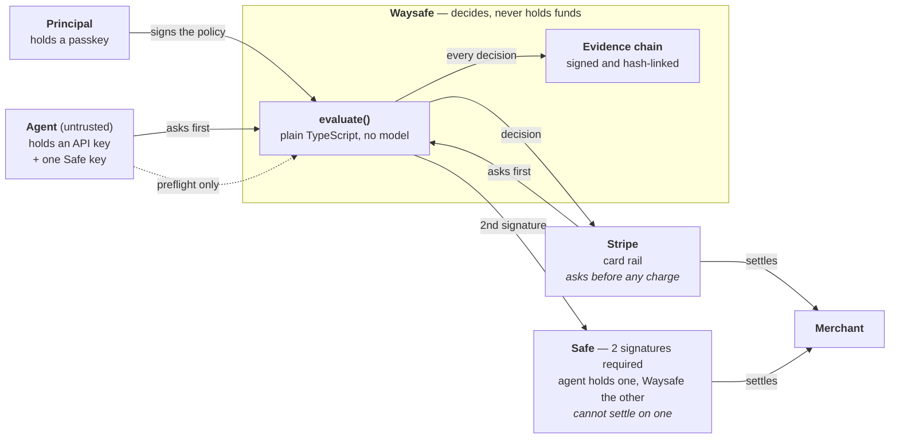
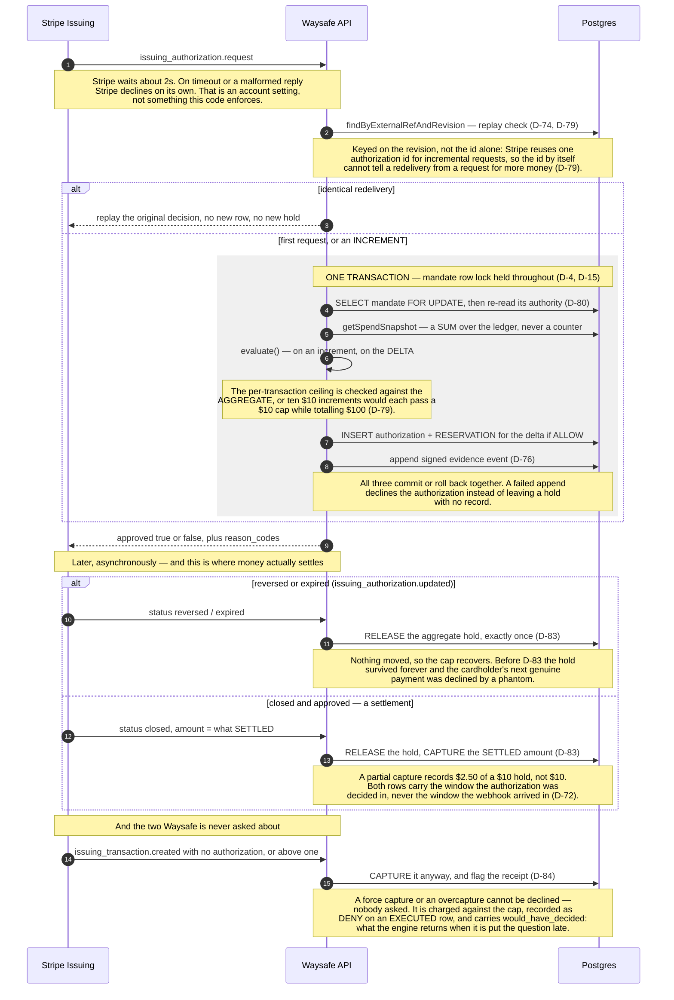
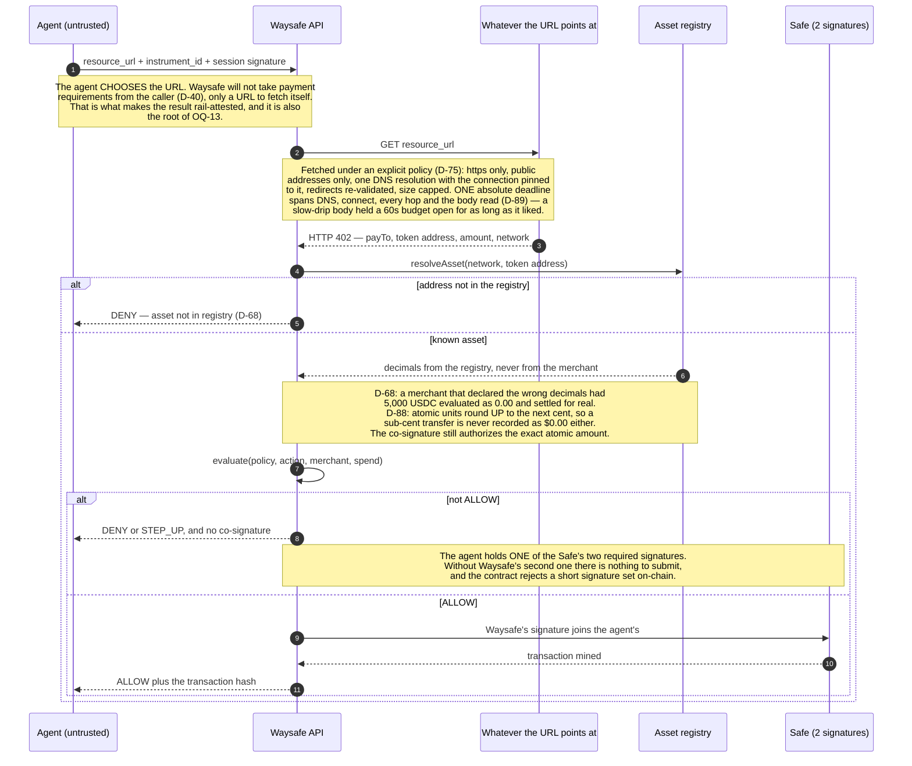

# Waysafe — Threat Model

**Audience:** a payments or risk lead deciding whether to rely on Waysafe as a required signer. This describes the system as it runs in this repository today.

**How to read it.** §0 is the system in five diagrams. §1–§8 are one attack surface each, in a fixed shape: the attack, the control, the decision-log entry (`D-n` in [`DECISIONS.md`](../DECISIONS.md)), the test file, and the residual risk. §9 is fail-closed behaviour on both rails. §10 lists what we do not know. The appendices hold the detail as tables.

Two rules this document follows. Every claim names a `D-n`, a test file, or says that no test covers it. A test gated on an external resource is marked as gated, because a test that exists and a test that ran are different claims (§8, D-77).

---

## 0. The system in one page

### 0.1 Who holds which key

Waysafe decides and never holds funds. Both rails ask Waysafe before money moves; the agent's own cooperation is never what stops it.

Appendix A lists each key, what it signs, and its blast radius.

### 0.2 The card lifecycle

Stripe asks, Waysafe answers inside about two seconds, and one transaction covers the decision, the ledger hold and the evidence event. Everything after the decision is the part that was missing until D-81 through D-84: a card authorization is not one event, and a hold that is never released is a cap that never recovers.

### 0.3 The on-chain decision path

The agent chooses the URL and Waysafe fetches it under a policy. The agent holds one of the Safe's two required signatures.

### 0.4 What can be forged

An agent can assert anything. The question each row answers is what that assertion can produce.

```mermaid
flowchart TB
  subgraph AG["An agent with a valid API key CAN assert"]
    direction TB
    A1["a merchant name, domain,<br/>psp_account, network_mid,<br/>onchain_address"]
    A2["an amount, a currency,<br/>a category"]
    A3["which resource_url<br/>Waysafe should fetch"]
    A4["a session signature over<br/>its own intended payment"]
  end

  subgraph AGN["and that assertion CANNOT produce ALLOW"]
    direction TB
    B1["any identifier it asserted<br/>caps at STEP_UP<br/>D-3, D-34, D-69"]
    B2["an identifier is never<br/>vouched for by a verified<br/>sibling in the same request<br/>D-69"]
    B3["payment requirements are<br/>never taken from the caller<br/>D-40"]
    B4["1 of 2 Safe owners.<br/>Threshold is 2.<br/>D-41"]
  end

  subgraph ME["A merchant CAN assert"]
    direction TB
    C1["its own payTo address<br/>and domain, in its 402"]
    C2["a token contract address"]
    C3["a decimals field"]
  end

  subgraph MEN["and that assertion CANNOT change the amount"]
    direction TB
    D1["decimals come from the<br/>asset registry, keyed on<br/>chain id + address.<br/>Mismatch is a loud DENY.<br/>D-68"]
    D2["an unknown address is<br/>DENY, never a guess<br/>D-68"]
    D3["OPEN: nothing binds that<br/>payTo to that domain<br/>except the merchant's own<br/>response. OQ-13"]
  end

  subgraph NE["NEITHER can"]
    direction TB
    E1["forge an evidence signature<br/>evidence key is not in either hand"]
    E2["raise a limit, or edit a policy<br/>policy is frozen at a hash<br/>the principal signed"]
    E3["turn its own STEP_UP into ALLOW<br/>needs a different, principal-named<br/>approver mandate's credential<br/>D-62, D-64"]
    E4["spend without the rail asking first<br/>enforcement is rail-initiated<br/>non-negotiable 9"]
  end

  A1 --> B1
  A1 --> B2
  A3 --> B3
  A4 --> B4
  C3 --> D1
  C2 --> D2
  C1 --> D3
```

### 0.5 Attack map

Ten surfaces, their controls, and what is still open. Status is in the text of each box, so colour is not the only signal. The five boxes added after the second independent review are C14 through C18.

```mermaid
flowchart LR
  classDef closed fill:#dcf2dc,stroke:#2e7d32,stroke-width:2px,color:#14321a
  classDef open fill:#ffe6cc,stroke:#c75300,stroke-width:2px,color:#4a2200
  classDef partial fill:#dceaf8,stroke:#1565c0,stroke-width:2px,color:#0c2b4d

  S1["<b>1</b> Leaked agent key"]
  S2["<b>2</b> Principal passkey"]
  S3["<b>3</b> RCE on the API process"]
  S4["<b>4</b> Database write access"]
  S5["<b>5</b> Compromised dependency"]
  S6["<b>6</b> Hostile merchant"]
  S7["<b>7</b> Replayed rail webhook"]
  S8["<b>8</b> Forged rail webhook"]
  S9["<b>9</b> Leaked org credential"]
  S10["<b>10</b> Prompt injection into the compiler"]

  C1["CLOSED — route auth is default-deny<br/>by credential tier<br/>D-64, D-65"]:::closed
  C2["CLOSED — a step-up needs a separate<br/>approver mandate, and costs both budgets<br/>D-62, D-71, D-73"]:::closed
  C3["CLOSED — challenge purpose is binding.<br/>A second passkey needs a grant<br/>D-66, D-67"]:::closed
  C4["CLOSED — merchant trust is per identifier.<br/>The directory is exact-match<br/>D-69, D-70"]:::closed
  C5["CLOSED — the asset registry owns decimals<br/>D-68"]:::closed
  C6["CLOSED — a replay returns the original.<br/>A unique index decides the race<br/>D-74"]:::closed
  C7["CLOSED — ledger rows carry the window<br/>the authorization was decided in<br/>D-72"]:::closed
  C8["CLOSED — HMAC signature checked<br/>on every rail webhook<br/>D-32"]:::closed
  C9["CLOSED — no model is ever in the<br/>authorization path, and the compiler<br/>asks rather than inventing a limit<br/>non-negotiable 1 and 8"]:::closed
  C12["CLOSED — the fetched URL is policy-checked<br/>and the connection pinned to the<br/>address that was validated<br/>D-75"]:::closed
  C13["CLOSED — decision, hold and evidence event<br/>are one transaction<br/>D-76, D-90"]:::closed
  C14["CLOSED — an agent reaches only its own<br/>authorizations, and never chooses<br/>the instrument at execution<br/>D-78"]:::closed
  C15["CLOSED — an increment is a new decision<br/>on the delta; the ceiling is checked<br/>against the aggregate<br/>D-79"]:::closed
  C16["CLOSED — the whole card lifecycle:<br/>reversal and expiry release, a capture<br/>records what SETTLED, a refund total<br/>credits only the delta<br/>D-81, D-82, D-83"]:::closed
  C17["CLOSED — a purpose per operation.<br/>A policy signature cannot mint<br/>an enrolment grant<br/>D-86"]:::closed
  C18["CLOSED — a nonzero transfer is never $0.00,<br/>and max_count keeps counting<br/>a payment after it settles<br/>D-87, D-88"]:::closed
  C10["PARTIAL — the chain is signed<br/>and hash-linked, and every decision<br/>is now in it<br/>D-26, D-53, D-90"]:::partial
  C19["PARTIAL — a force capture or overcapture<br/>cannot be declined, because nobody asks.<br/>It is charged against the cap and flagged<br/>with what the engine WOULD have decided<br/>D-84"]:::partial
  C11["PARTIAL — the principal signs one<br/>policy hash, so an injected policy<br/>still needs a human ceremony<br/>D-20"]:::partial

  O1["OPEN — the co-signer key alone completes<br/>any session-signed transaction.<br/>A Safe Guard is named, not built<br/>D-56, D-59"]:::open
  O2["OPEN — the chain has no external anchor,<br/>so completeness is unprovable<br/>OQ-8"]:::open
  O3["OPEN — the auth challenge is predictable;<br/>replay is bounded only by signCount<br/>OQ-12"]:::open
  O4["OPEN — on x402, VERIFIED means the host<br/>asked, not that it is who it claims<br/>OQ-13"]:::open
  O5["OPEN — DB write access mints credentials<br/>and biases the spend SUM<br/>D-54, no test"]:::open
  O6["OPEN — a packages/core dependency<br/>can alter evaluate() itself<br/>D-43, no test"]:::open
  O7["OPEN — no kill switch for the<br/>Safe co-signer key<br/>D-58"]:::open
  O10["OPEN — an org credential can enrol a<br/>principal's FIRST passkey and activate a<br/>mandate unaided. D-66's grant covers<br/>only a second one"]:::open
  O11["OPEN — the principal reads a summary,<br/>not the policy hash. Nothing proves the<br/>human understood what they signed"]:::open
  O12["OPEN — a step-up EXPIRY releases a<br/>reservation with nothing in the<br/>signed chain to say so<br/>OQ-14"]:::open
  O13["OPEN — no rate limiter on any route.<br/>A leaked key is bounded by policy,<br/>never by volume"]:::open

  S1 --> C1
  S1 --> C2
  S1 --> C4
  S1 --> C12
  S1 --> C14
  S1 --> O13
  S2 --> C3
  S2 --> C17
  S2 --> O3
  S3 --> C10
  S3 --> O1
  S3 --> O7
  S4 --> O5
  S4 --> C10
  S5 --> O6
  S6 --> C5
  S6 --> C4
  S6 --> C18
  S6 --> O4
  S7 --> C6
  S7 --> C7
  S7 --> C13
  S7 --> C15
  S7 --> C16
  S7 --> C19
  S8 --> C8
  S9 --> C1
  S9 --> O10
  S10 --> C9
  S10 --> C11
  S10 --> O11
  C10 --> O2
  C13 --> O12
```

---

## 1. A leaked agent key

**The attack.** An attacker holding one agent API key makes requests as that agent. Before D-64 it could also mint a key for any other agent in the organization, including its own approver's, which collapsed the two-credential approval requirement back to one key.

**The control.** Route authorization is default-deny by credential tier: every route is org-credential-only unless explicitly listed as agent-accessible. Four more routes with the same shape were closed in the same inversion, the worst being mandate creation, which had let an agent write itself a policy with any ceiling. Resolving a step-up requires a different, principal-named approver mandate's own credential, and an approval now costs budget on both mandates.

**D-numbers.** D-18, D-62, D-64, D-65, D-71, D-73, D-78. Reversed once: D-59 recorded this as closed by D-62, and D-64's finding reopened it.

**Tests.** `apps/api/src/server.adversarial.test.ts` (eight attack cases plus a structural guard that enumerates every registered route), `apps/api/src/authorization/service.test.ts`, `apps/api/src/authorization/budget.adversarial.test.ts` (gated on `DATABASE_URL`), `apps/api/src/review2.adversarial.test.ts` R4 for the object-authorization case (gated).

**Blast radius, after D-78.** One leaked agent key reaches that agent's own authorizations and nothing else. Until D-78 the route tier was the only check, so any agent credential in the organization could list, read and execute *another* agent's authorization — and choose the payment instrument at execution, which is how the second independent review spent an authorization it did not own. List and read are now scoped to the acting agent, and execution resolves the instrument from the authorization's own declared `payment_method_ref` rather than from the request body. The step-up route deliberately keeps no ownership check, because D-62 requires the resolver to be a *different* agent.

**Residual risk.** Authority now depends on two credentials, which reduces blast radius only if they are held with genuinely separate custody, and nothing in this codebase enforces that. There is also no rate limiter on any route, so a leaked key is bounded by policy rather than by volume.

---

## 2. The principal's passkey

**The attack.** The passkey is what turns a compiled policy into an active mandate, so it is not bounded by anything else in this document. Before D-66, an authentication challenge could be answered with a registration response, which enrolled an attacker's own passkey against a victim principal.

**The control.** Every challenge records the purpose it was issued for, and a caller's mode is validated against it. A mismatch is a `400 challenge_purpose_mismatch`. Enrolling a second passkey for a principal that already has one requires a fresh prior authentication with an existing credential, as a single-use expiring grant bound to that principal and credential.

**One purpose per operation, after D-86.** D-66 made the purpose binding but left one value, `AUTHENTICATION`, covering two different operations: activating a mandate, and proving control of an existing passkey in order to enrol another. Both completion paths accepted it, so the signature a principal gives to confirm a policy — the one ceremony a real principal is actually shown — could be redeemed at the passkey route to mint an enrolment grant for an authenticator of the attacker's choosing. The second independent review did exactly that. `MANDATE_AUTHENTICATION` and `REENROLLMENT_AUTHENTICATION` are now distinct, each accepted only by its own path; the legacy value is accepted nowhere.

**D-numbers.** D-20, D-29, D-66, D-67, D-86.

**Tests.** `apps/api/src/server.adversarial.test.ts`, `apps/api/src/webauthn/service.test.ts`, `apps/api/src/webauthn/webauthn.test.ts`, `apps/api/src/review2.adversarial.test.ts` R5 (gated on `DATABASE_URL`) — including a control that the legitimate re-enrollment ceremony still works end to end.

**Residual risk.** An org credential can still enrol a principal's *first* passkey and activate a mandate with no human present, because D-66's grant only covers a second one. OQ-12 — the mandate-activation challenge being derived from the public policy hash rather than being random — is **narrowed by D-86** to mandate activation alone: the re-enrollment challenge is random, and is now the only value its own path will take.

**What WebAuthn still resists, and what it does not.** The private key never leaves the authenticator. Relying-party id and origin are checked on every ceremony, and production's RP ID is `dashboard.waysafe.ai` rather than the apex, so no other subdomain can ever present it (D-29). Two paths defeat that and neither is defended against here: a compromised script running at the legitimate origin, and device-level compromise that never goes through a browser ceremony.

---

## 3. Code execution on the API process

**The attack.** Five secrets load into this one process: the evidence signing key, the x402 attestation key, the Safe co-signer key, and two Stripe keys. An attacker with code execution here holds all of them.

**The control.** There is no control for the keys themselves. §7 describes where they live. The Safe's threshold of 2 does not help, because the co-signer is one of its two legitimate owners.

**D-numbers.** D-56, D-59, D-63.

**Tests.** None for this scenario; it is not a credential-theft case a test can express. The co-signer finding was demonstrated by a real broadcast, tx `0x6a3510ae998379de96e2fadde2e44161c3368ca8f4265dce3217ca58ec43088d`, a successful transfer completed by the co-signer alone over a session-signed payload (D-56).

**Residual risk.** This is the largest open item in this document, and §9 states it in full.

**One secondary exposure.** The logger redacts a hand-maintained list of paths in `apps/api/src/server.ts`. It is a blocklist, so a new field carrying a credential is logged until someone adds it. A 5xx response body never echoes an error message (D-75), so an internal failure no longer leaks its text to a caller.

---

## 4. Database write access

**The attack.** An attacker who can write rows but has none of §3's keys can mint credentials from nothing: `verifyKey` looks up a prefix and compares a SHA-256 hash, so inserting a row with a hash of a chosen secret is enough to authenticate. The same access can insert `LedgerEntry` rows, which changes what every future `evaluate()` believes has been spent.

**The control.** None for either. Evidence is the one thing this attacker cannot forge: the signing key lives only in process memory, so a rewritten chain fails `signature_invalid` against the published key.

**D-number.** D-54.

**Tests.** `packages/core/src/evidence.test.ts` proves the forgery-detection half, including a full-chain rewrite. **No test covers the credential-minting or ledger-biasing claims.** They are read from the code, not demonstrated.

**Residual risk.** Database write access is authority over future decisions, even though it is not authority over past records.

---

## 5. A compromised dependency

**The attack.** Blast radius depends on which process the dependency's code runs in. A package reachable from `packages/core` can alter `evaluate()` itself, which produces an incorrect ALLOW without touching a key.

**The control.** None. `@waysafe/core/browser` exists so the dashboard and the browser bundle do not pull in `node:crypto`, which narrows what reaches a browser, and does not narrow what reaches the API.

**D-number.** D-43.

**Tests.** **No test covers this.** The browser entry point's import surface was verified mechanically at D-43; nothing tests for a hostile dependency.

**Residual risk.** A `packages/core` dependency is the one supply-chain position that changes decisions rather than stealing credentials, and nothing in this document bounds it.

---

## 6. Replayed and forged rail webhooks

**The attack.** Stripe redelivers events. Before D-74 an identical redelivery produced a second authorization row and a second reservation, so $120 was held for one $60 card authorization, and the duplicate hold had no event that would ever clear it. A forged webhook would be a different attack: asserting a decision Stripe never made.

**The control.** A replay returns the original decision, writes no new row and takes no new hold. Two concurrent deliveries are decided by a unique index on `(mandateId, externalRef)`, because the lookup alone sits outside the transaction. Every rail webhook's HMAC signature is verified against the raw request bytes, which is why the JSON parser preserves them.

**The replay key was not enough, and the lifecycle was not modelled.** Four defects the second independent review found here, all now closed and drawn in §0.2:

- **An incremental request replayed the original approval (D-79).** Stripe reuses one authorization id for increments, so keying the replay on the id alone meant $10 approved, then the same id re-presented at $10,000, approved. The key is now `(externalRef, revision)`, an increment is decided as a new decision on the delta, and the per-transaction ceiling is checked against the aggregate.
- **A provider event was consumed before its effect committed (D-81).** The event row was written first, so a ledger failure left the event marked processed, the retry classified as a duplicate, and the budget uncredited. The event and its effect now commit together, and a failure is explicitly retryable rather than silently terminal.
- **A cumulative refund total was applied as a delta (D-82).** Stripe's `amount_refunded` is a running total. $40 then $100 of one $100 charge produced a net ledger amount of **minus $40** — $140 of fresh budget out of a $100 charge. Only the delta is credited now.
- **Reversals and expiries never released their hold, and a partial capture recorded the wrong amount (D-83).** Every Issuing update except `closed && approved` was ignored, so a reversed authorization held budget forever. A settlement now captures what settled, not what was authorized.

**And two the rail never asks about (D-84).** A **force capture** is a settlement the network clears without ever presenting an authorization; an **overcapture** settles above what was approved. Neither can be declined, because nobody is asked. `issuing_transaction.created` was not handled at all, so both moved money with nothing in Waysafe recording it. Both are now charged against the cap and recorded as a `DENY` on an `EXECUTED` row — honest about both facts — carrying `DENY_SETTLED_WITHOUT_AUTHORIZATION` or `DENY_SETTLED_ABOVE_AUTHORIZATION`, the network's own `merchant_data` for the dispute, and `would_have_decided`: what the engine returns when the forced settlement is put to it after the fact.

**D-numbers.** D-32, D-74, D-76, D-79, D-81, D-82, D-83, D-84.

**Tests.** `apps/api/src/authorization/budget.adversarial.test.ts` cases (d), (d2), (d3) (gated on `DATABASE_URL`), `apps/api/src/enforcement/stripe-issuing.test.ts` for signature verification, `apps/api/src/enforcement/decision-atomicity.test.ts` for D-76, and `apps/api/src/review2.adversarial.test.ts` R1, R2, R6, R7 and R7b for the lifecycle (gated).

**Residual risk.** The unique index excludes one historical literal, `iauth_demo_goodbeans_card_9001`, because six pre-D-74 demo rows carry it and are the subjects of published evidence events. A test keeps that literal unmintable (D-74 follow-up).

---

## 7. The evidence chain

**What verifying a chain proves.** Authorship, that the record was signed by the holder of the published key. And internal consistency, that no shown entry was altered afterwards; a forged or edited event fails at `hash_mismatch` or `signature_invalid`.

**What it does not prove.** Completeness. A party controlling both the database and the signing key can present a real, correctly-signed chain that omits events. An omission in the middle of a shown range leaves a sequence gap. An omission at the end is invisible, because hashing and signing only ever operate on the events presented.

**Every decision is now in it (D-90).** This was not true until D-90. The rail-initiated paths each appended decision evidence; `POST /v1/authorizations` persisted the authorization row and any reservation but appended nothing, so the second independent review found only `agent_key.verified` events for an ordinary ALLOW. ALLOW, DENY and STEP_UP now each append a signed `authorization.decided` event in the same transaction as the decision and its hold (D-76): with a failing evidence repository, the request is rejected and Postgres holds neither a row nor a hold.

Three paths still write no decision event, and only the first is a gap. A **step-up expiry** releases a reservation with nothing in the chain to say so (**OQ-14**). A request with **no mandate row** has no subject to attach an event to, and the attempt is still recorded as `agent_key.verified` or `agent_key.rejected`. An **idempotent replay** returns the original decision, whose event already exists.

**D-numbers.** D-26, D-53, D-54, D-76, D-90. OQ-8 and OQ-14 are the open questions.

**Tests.** `packages/core/src/evidence.test.ts`, `packages/core/src/evidence-signing.test.ts`, `packages/sdk/src/index.test.ts` for independent verification without trusting the server, `apps/dashboard/src/lib/demo/browser-verify.test.ts` for the browser verifier, `apps/api/src/review2.adversarial.test.ts` R12 for decision evidence on the agent path and its rollback property (gated on `DATABASE_URL`). **No test covers tail omission**, which is a property of the construction rather than a behaviour to assert.

**Residual risk.** Closing the completeness gap needs an external anchor: a public chain, a transparency log, or an RFC 3161 timestamp. No such mechanism exists here.

---

## 8. Key custody, rotation and revocation

**Where the keys live.** A `Signer` interface sits in front of every signing operation, and `EnvSigner` is its only implementation. It reads a plaintext private key from an environment variable, decodes it once, and holds it in a `#private` field for the process's lifetime. No hardware or service boundary separates "the process is compromised" from "the key is compromised".

What changed at D-63 is where the boundary sits in the code. Key material is reachable from one class instead of from every call site, so a KMS-backed signer becomes a new class plus config. `#private` is a language-level boundary. **We have not tested whether it survives a heap dump**, and an attacker with code execution reaches the key regardless (§3).

Three signers are constructed at boot, and `assertDistinctSigners` refuses to start if any two share a public key. All three sign through the interface, including the Safe co-signer, which needed two adapters because neither viem nor `@safe-global/protocol-kit` accepts a `Signer`. Byte-equivalence against the raw account is asserted for all three operations, including an EIP-712 `SafeTx` payload.

**D-numbers.** D-53, D-58, D-63.

**Tests.** `packages/core/src/signer.test.ts`, `apps/api/src/signing/env-signer.test.ts` (including a test that the private key appears nowhere in logged output).

**Rotation and revocation, per key.** Appendix A's last column states each one. Two are honest gaps. Rotating the evidence signing key today makes every historical signature fail, because both repositories' `getKeyDirectory()` returns a single entry with no path to publish a retired key; D-53 built the verification side of rotation and not the publishing side. The Safe co-signer key has **no kill switch**: it is a permanent owner of every deployed Safe, and this codebase has no code path to call `swapOwner`.

**Why the Safe co-signer gap is accepted today.** The deployed Safe holds 20 test USDC (D-49). At that scale, abandoning old Safes and deploying fresh ones under a new key is a realistic response. That stops being true with more live Safes, more value in any one of them, or a real incident that needs rotation and finds the tooling still absent.

**Reliability of the proofs above.** Seven test files need a real Postgres and skip themselves when one is absent, which previously happened silently. Since D-77 they run in their own serial pass and every run prints one line per skipped suite naming the variable that would enable it. Appendix C lists which suites are gated and on what.

---

## 9. Fail-closed behaviour

**Card rail.** Stripe's `issuing_authorization.request` webhook waits about two seconds. This account's Issuing configuration has "decline on timeout" enabled, so a late or malformed reply is declined by Stripe. That is an account setting observed in Stripe's dashboard, not something this repository's code asserts or could enforce.

Three application-level declines hold regardless of that setting. An unrecognized event type returns `{approved: false, reason_codes: []}`. A card with no resolvable instrument returns `DENY_NO_ACTIVE_MANDATE`. A `STEP_UP` has no channel to a human inside two seconds, so it declines (D-33 point 4).

A fourth was added at D-76. A decision that cannot be recorded returns `DENY_DECISION_NOT_RECORDED` rather than throwing, so failing closed no longer depends on Stripe's timeout setting.

**Measured latency.** The D-76 evidence append costs about 37ms: 195ms median joined to the decision transaction against 158ms in its own. End-to-end decision latency measured 548–595ms in one run and 586–1776ms in another. The dominant term is the database round trip. A cold connection can put one decision within about 200ms of Stripe's limit, which is a deployment property of using a cloud database that scales to zero.

**On-chain rail.** Each mandate's Safe is a threshold-2 multisig with the agent's session key as one owner and the co-signer as the other (D-41). `toResponse` returns `co_signature: null` for anything other than ALLOW, so there is nothing to submit. Three bypass cases were broadcast to Polygon Amoy and each was mined `reverted`; Appendix D lists the hashes and the revert codes.

**Tests.** `apps/api/src/enforcement/stripe-issuing.test.ts`, `apps/api/src/enforcement/decision-atomicity.test.ts`, `apps/api/src/enforcement/x402.bypass.test.ts`. Part 3 of the bypass test broadcasts real transactions and is gated on four variables; parts 1 and 2 run offline. `apps/api/src/enforcement/stripe-issuing.bypass.test.ts` is gated on a Stripe Issuing key and self-skips five further ways, so cite a run rather than the file.

---

## 10. What we don't know

Six items, each with its decision-log entry. None is fixed, and none is presented as mitigated.

**The Safe co-signer key alone completes any session-signed transaction (D-56, D-59).** The threshold of 2 defends against an attacker holding only the session key, proven on-chain. It does not defend against an attacker holding the co-signer key, because every genuine request already supplies a real session signature. What stands between a compromised co-signer key and an unauthorized settlement is application code inside the process whose compromise is the premise.

A Safe Guard is the named remediation direction and is not built. A 2-of-3 Safe adding the principal does not close it: a standard Safe threshold is any N of M, and co-signer plus session key already satisfies it.

**The evidence chain has no external anchor (OQ-8).** See §7. Completeness cannot be proven to a third party.

**The mandate-authentication challenge is predictable (OQ-12).** It is derived from the public `policy_hash`. Nothing here depends on it being unguessable, so there is no live hole. Replay of a captured assertion onto another mandate sharing that hash is prevented only by WebAuthn's signature counter, which some real platform authenticators always report as zero. Three candidate fixes are recorded; none is built.

**On x402, VERIFIED means the host asked (OQ-13).** The payee address and the domain both come from Waysafe's own fetch, so the agent forges neither. The host serving the resource declares its own payee address, and nothing outside that host corroborates the pairing. The agent also chooses the URL. A mandate naming real merchants is unaffected; a mandate relying on `unlisted: ALLOW` plus "the merchant was verified" gets less assurance here than on a card.

**Database write access (D-54).** §4. Credential minting and ledger biasing are read from the code and covered by no test.

**A `packages/core` dependency can alter `evaluate()` (D-43).** §5. No test covers it.

---

## Appendix A. Key inventory

| Key | Type | Signs | An attacker with it can | Cannot | Rotation today |
|---|---|---|---|---|---|
| `WAYSAFE_EVIDENCE_SIGNING_KEY` | Ed25519 | the SHA-256 hash of one evidence event | forge a correctly-signed decision history, or re-sign an altered one | authorize any payment on either rail; `evaluate()` runs regardless of whether the event signs | **breaks all history.** `getKeyDirectory()` returns one entry (D-58) |
| `WAYSAFE_X402_COSIGNER_KEY` | Ed25519 | an off-chain x402 attestation, ALLOW only | forge a plausible "Waysafe approved this" claim | move any on-chain funds; Ed25519 has no EVM address, so it cannot be a Safe owner | env swap and restart; no consumer pins it |
| `WAYSAFE_SAFE_COSIGNER_KEY` | secp256k1 | a real Safe `execTransaction` | complete any transaction already carrying a session signature (D-56) | produce a valid transfer with no session signature anywhere; the contract reverts, `GS020` | **none.** Permanent Safe owner, no `swapOwner` path (D-58) |
| `STRIPE_SECRET_KEY` | Stripe | Payment Intents on Waysafe's account | create, capture and refund entirely outside `evaluate()` | nothing constrains it; Stripe does not consult the mandate | Stripe dashboard, instant |
| `STRIPE_ISSUING_SECRET_KEY` | Stripe | cardholder and card creation | create cards bypassing `provisionCardForMandate`'s gates | buy anything with them: the authorization webhook finds no instrument and returns `DENY_NO_ACTIVE_MANDATE` | Stripe dashboard, instant |

Agent API keys are `wsf_live_` plus an 8-character lookup prefix and a 224-bit secret tail. Only the prefix and a SHA-256 hash are stored, and the full key is shown once (D-18). **No test covers whether an API key can reach a log**; the leak test in `apps/api/src/signing/env-signer.test.ts` covers private keys. Revocation is immediate on the next request (`revokeKey`, D-18) and does not undo a completed execution.

## Appendix B. Controls, decisions and tests

| Surface | Control | D | Test |
|---|---|---|---|
| Route authorization by credential tier | default-deny allowlist | D-64, D-65 | `server.adversarial.test.ts` |
| Step-up resolution | separate approver mandate; costs both budgets; re-validated under the lock | D-62, D-71, D-73 | `service.test.ts`, `budget.adversarial.test.ts` ᵈᵇ |
| Passkey enrolment | challenge purpose binding; grant for a second passkey | D-66, D-67 | `server.adversarial.test.ts` |
| Merchant identity | per-identifier trust; exact-match directory | D-3, D-34, D-69, D-70 | `merchant.adversarial.test.ts` |
| Asset units | registry owns decimals, keyed on chain and address | D-68 | `x402.adversarial.test.ts` |
| Cumulative spend | SUM over the ledger under a row lock | D-4, D-15 | `prisma-repository.test.ts` ᵈᵇ |
| Ledger windows | stamped at authorization, never recomputed | D-72 | `budget.adversarial.test.ts` ᵈᵇ |
| Webhook replay | original decision replayed; unique index decides races | D-74 | `budget.adversarial.test.ts` ᵈᵇ |
| Webhook authenticity | HMAC over raw bytes | D-32 | `stripe-issuing.test.ts` |
| Caller-supplied URL fetch | policy, one resolution, pinned address, redirects re-validated | D-75 | `x402-ssrf.adversarial.test.ts` |
| Decision durability | decision, hold and evidence in one transaction | D-76 | `decision-atomicity.test.ts` ᵈᵇ |
| Key separation | three signers, distinct public keys asserted at boot | D-63 | `signer.test.ts`, `env-signer.test.ts` |
| On-chain threshold | 2-of-2 Safe, three rejections broadcast | D-41, D-57, D-60 | `x402.bypass.test.ts` ˡⁱᵛᵉ |

ᵈᵇ gated on `DATABASE_URL`. ˡⁱᵛᵉ part 3 gated on four on-chain variables.

## Appendix C. Gated suites

Seven files need a real Postgres and run in their own serial pass (D-77). Two more need external credentials. Every run prints one line per skipped suite.

| Suite | Needs | Require flag |
|---|---|---|
| `authorization/prisma-repository.test.ts` | `DATABASE_URL` | `WAYSAFE_REQUIRE_DB` |
| `authorization/budget.adversarial.test.ts` | `DATABASE_URL` | `WAYSAFE_REQUIRE_DB` |
| `enforcement/decision-atomicity.test.ts` | `DATABASE_URL` | `WAYSAFE_REQUIRE_DB` |
| `evidence/prisma-repository.test.ts` | `DATABASE_URL` | `WAYSAFE_REQUIRE_DB` |
| `principals/prisma-repository.test.ts` | `DATABASE_URL` | `WAYSAFE_REQUIRE_DB` |
| `agent-keys/prisma-repository.test.ts` | `DATABASE_URL` | `WAYSAFE_REQUIRE_DB` |
| `webauthn/prisma-repository.test.ts` | `DATABASE_URL` | `WAYSAFE_REQUIRE_DB` |
| `payments/stripe-adapter.test.ts` | `STRIPE_SECRET_KEY` | `WAYSAFE_REQUIRE_STRIPE` |
| `enforcement/stripe-issuing.bypass.test.ts` | `STRIPE_ISSUING_SECRET_KEY` | `WAYSAFE_REQUIRE_STRIPE_ISSUING` |
| `enforcement/x402.bypass.test.ts` part 3 | `WAYSAFE_SAFE_COSIGNER_KEY`, `POLYGON_AMOY_RPC_URL`, `WAYSAFE_X402_LIVE_PAYER_ACCOUNT`, `WAYSAFE_X402_TEST_SESSION_KEY` | `WAYSAFE_REQUIRE_X402_LIVE` |

`stripe-issuing.bypass.test.ts` self-skips five further ways after its gate passes, including when the financial account has no available balance. That is its current state: real authorizations on this account decline with `insufficient_funds` (D-74 follow-up, checked 2026-10-05).

## Appendix D. On-chain record

Broadcast to Polygon Amoy and each independently confirmed by replaying the mined call at its own block (D-57, D-60). All three appear on `/proof`.

| Case | Transaction | Result |
|---|---|---|
| session key alone | `0x5dcfce81647659ded7b0d4b4a55ab8faf2bf2562b2f301753cb99141dcf2531e` | reverted, `GS020` signatures data too short |
| forged envelope | `0xa64add925e931c2e4fef37bb78acc00f8e896bd625166f5a792efaa82c0e8ae1` | reverted, `GS026` invalid owner |
| signature for a different transfer | `0xee2945a57559bab96b8676a41dd4c95f20aed28d9da56225f03c948776869a5d` | reverted, `GS026` invalid owner |
| co-signer alone completes a session-signed transfer (D-56) | `0x6a3510ae998379de96e2fadde2e44161c3368ca8f4265dce3217ca58ec43088d` | **succeeded.** This is §10's first item |

An earlier capture's third case duplicated the first and was replaced (D-60). `x402.bypass.test.ts` part 3 covers cases 1 and 2 and a genuine 2-of-2 transfer; its third live case is also session-key-only, so it is not a counterpart of the third row above.
